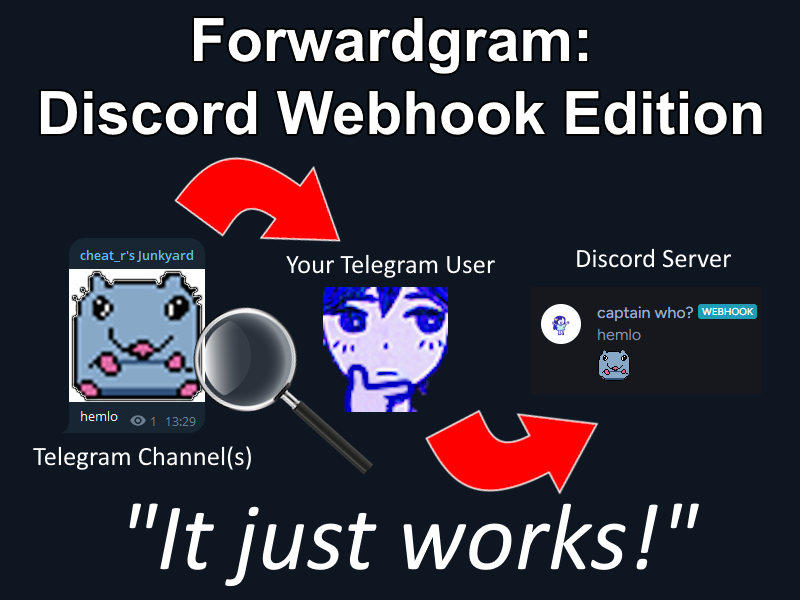

#  Forwardgram: Discord Webhook Edition — Forward Telegram Messages to Discord

## Description
Forwardgram is a script that uses your Telegram account for parsing new messages from one or more Telegram channels and forwards them to Discord channel using webhook. All you need is your Telegram and Discord accounts!

### Dependencies
- Python 3.6+ and libraries from `requirements.txt`
- Telegram account with valid phone number
- Discord webhook link (if you don't know what this is, check out Discord's [guide](https://support.discord.com/hc/en-us/articles/228383668-Intro-to-Webhooks)).

### Installing and Setup
1. Clone this repository
2. Install required libraries (simpliest way is to open cloned folder in console and running `python3 -m pip install -r requirements.txt`)
3. Fill out `config.yml` file
4. Run `python3 forwardgram.py`!

### Running and using
In the first time initializing the script, you will be requried to validate your phone number using Telegram API. This happens only at first time per session name. Don't worry, your account will be used only for reading messages, not for sending them (or anything else)!

If any errors occur, it means that you have filled something wrong in config. If not, please report it through Issues!

### Commands
Use them somewhere in silent and cozy place, like Saved Messages.
- `!reload` - reloads config
- `!reparse` - updates channel list (use after `!reload`)

## Credits
* voidbar - [forwardgram](https://github.com/voidbar/forwardgram) (original repository made for use only inside telegram)
* kkapuria3 - [Telegram-To-Discord-Forward-Bot](https://github.com/kkapuria3/Telegram-To-Discord-Forward-Bot) (fork for reposting to discord instead of telegram)
* Sqble - [Telegram-To-Discord-Bot-Fixed](https://github.com/Sqble/Telegram-To-Discord-Bot-Fixed) (fix of fork, but still not so usable)
* cheat_r - forwardgram_discord (complete rewrite based on Sqble's fork; if you don’t praise yourself, no one will)

## TODO
- [ ] Advanced attachments support, such as stickers, voice messages, polls, etc. (High priority)
- [ ] Adapt Telegram text formatting to Discord (Planned)
- [ ] Show replies to messages from other chats
- [ ] Message editing (?)
- [ ] Implement forwarding to several Discord webhooks simultaneously (?)

## License
This repository is NOT licenced (yet). You can do whatever you want with this code, as long as you mention me and other authors, if you plan to publish your own source code.
